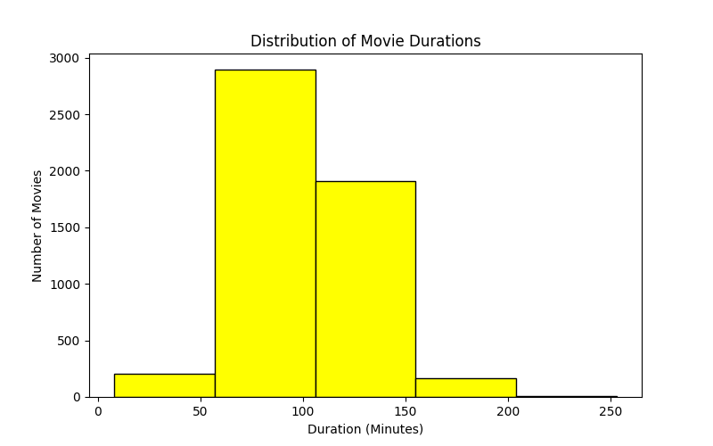
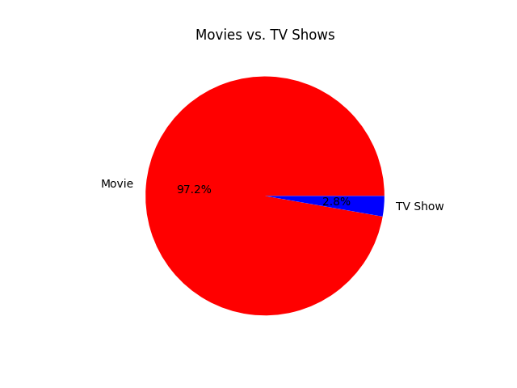

# 📺 Netflix Ratings Analysis 📊

A beginner-friendly data analysis project where I explored, cleaned, and visualized data from a Netflix dataset using Python. This was my first step into practical data analytics projects.

---

## 📌 Project Description

In this project:
- Performed exploratory data analysis (EDA)
- Cleaned and handled missing data
- Visualized insights using Matplotlib and Seaborn
- Analyzed the distribution of content types (Movies vs TV Shows)
- Checked average movie durations
- Visualized null values across columns

---

## 📂 Project Structure

Netflix-Ratings-Analysis/
│
├── Netflix_Analysis.py # Python analysis script
├── netflix_titles.csv # Dataset used for analysis
├── DA First Project.docx # Project documentation
├── Graphs/ # Folder containing generated plots
│ ├── hist_chart.png
│ └── (Add more graphs here)
└── README.md # Project overview (this file)

---

## 📊 Sample Graphs

---

## 🛠️ Tools & Technologies

- Python 3
- Pandas
- Matplotlib
- Seaborn
- Git & GitHub

---

## 📌 Author

**Varun Kumar**  
Future Software Engineer | Data Analyst 📊  
[GitHub Profile](https://github.com/Varun-men)

---

## 🚀 Project Status

✅ Completed ✔️ — open for improvements!
